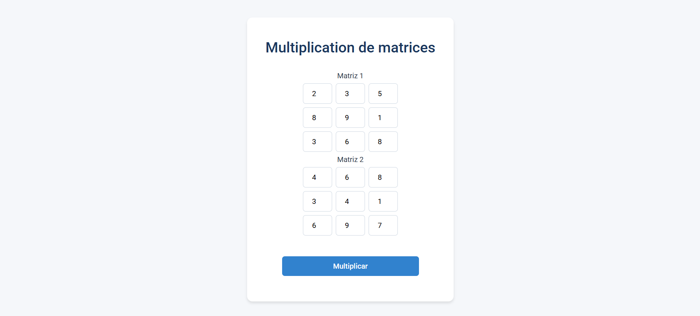
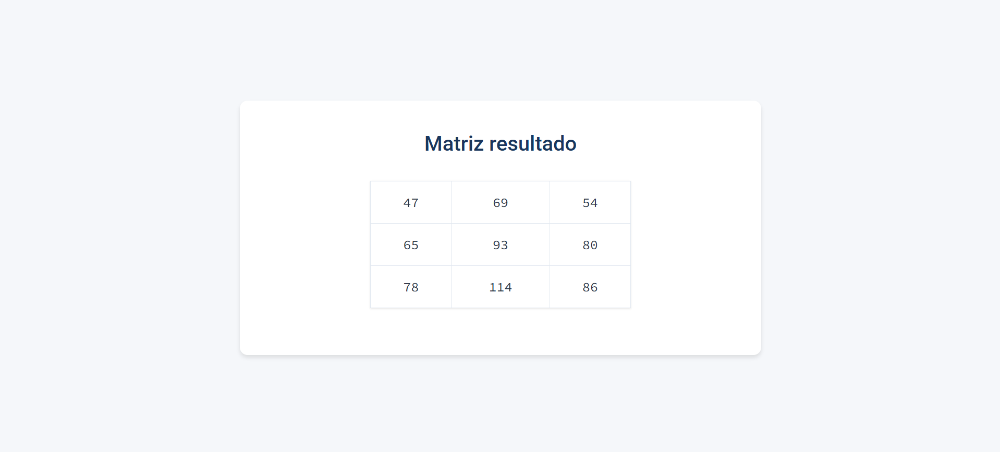

Matrix Multiplication Web App

Description
-----------
This project is a simple web-based matrix multiplication tool that allows users to input two 3x3 matrices and calculate their product. The interface is built with HTML and styled with modern CSS, while the logic for the matrix multiplication is handled by PHP on the server side.

Features
--------
- User-friendly interface for entering two 3x3 matrices
- Input validation to ensure all fields are filled
- Responsive design with a clean and modern look using Google Fonts
- Matrix multiplication implemented in PHP
- Results displayed dynamically in a styled HTML table

Files
-----
- `index.html` – Main form for inputting the matrices
- `matrixmult.php` – PHP script that processes the multiplication and displays the result
- `style.css` – CSS stylesheet for styling the form and result page
- `img/matrixfavicon.png` – Favicon for the site (optional)

How to Use
----------
1. Open `index.html` in a browser using a local server (e.g., XAMPP, WAMP, or similar).
2. Enter values into both 3x3 matrices.
3. Click the "Multiplicar" button.
4. The result of the multiplication will be displayed in a new styled page.

Requirements
------------
- Web browser
- Local web server with PHP support (e.g., XAMPP, WAMP, MAMP)
- PHP 5.6+ recommended

Notes
-----
- Currently supports only 3x3 matrices.
- Does not store input or output data.
- Matrix entries must be numeric and are required.

Screenshots
-----

